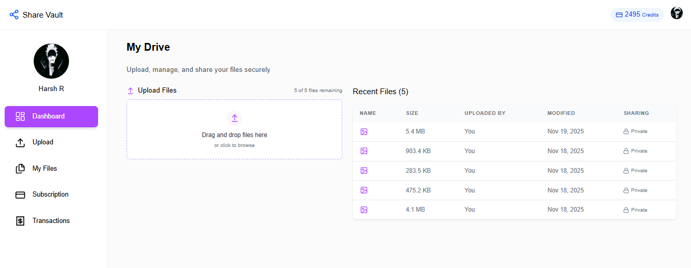
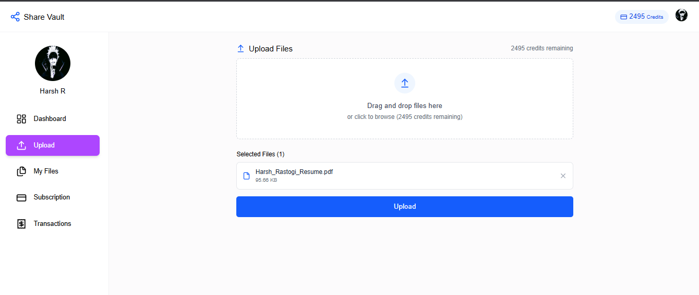
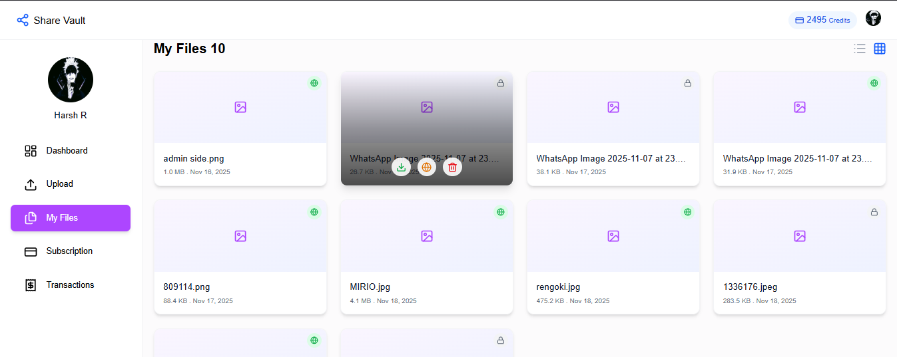
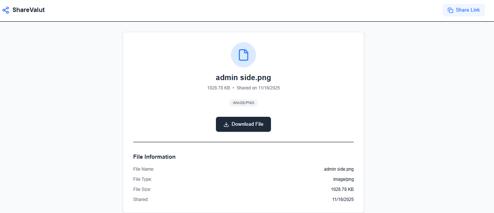

# 📦 ShareVault – Frontend

A secure and seamless cloud file-sharing frontend built with React, designed to work with the ShareVault backend powered by Spring Boot, MongoDB, and AWS S3. The frontend provides an intuitive UI for uploading, managing, and sharing files with public/private access controls.

## 🚀 Features

1. User Authentication (Clerk) – Sign-in, sign-up, and session management

2. File Upload Interface – Drag & drop or manual upload

3. File Privacy Toggle – Mark files as Public or Private

4. Public File Preview & Sharing – Generate shareable public URLs

5. Real-time Upload Status – Progress bars & instant UI updates

6. Modern UI/UX – Clean, minimal, and responsive interface

7. REST API Integration – Communicates with ShareVault backend APIs

8. Error Handling & Toast Alerts – Smooth user experience

## 🏗️ Tech Stack

1. React.js

2. Vite

3. Axios

4. Clerk Authentication

6. Tailwind CSS

7. React Router

8. Shadcn/UI Components

## 📁 Project Structure

```src/
 ├── components/
 ├── pages/
 ├── hooks/
 ├── utils/
 ├── api/
 ├── context/
 ├── App.jsx
 ├── main.jsx
 └── index.css
 ```

## 🔌 Backend Integration

a. The frontend consumes the ShareVault backend APIs for:

b. Uploading files

c. Generating pre-signed S3 upload & download URLs

d. Fetching metadata

e. Managing privacy settings

f. Deleting files

### Example API flow:

``` React → Backend API → AWS S3 → Backend MongoDB → React UI ```

## 🛠️ Installation & Setup

1️⃣ Clone the repository
git clone https://github.com/your-username/sharevault-frontend.git
cd sharevault-frontend

2️⃣ Install dependencies
npm install

3️⃣ Set environment variables

Create a .env file:

``` VITE_CLERK_PUBLISHABLE_KEY=xxx```
```VITE_BACKEND_API_URL=http://localhost:8080/api```

4️⃣ Run the development server
npm run dev

🧪 Build for Production
npm run build

## 🔐 Authentication (Clerk)

1. Uses Clerk for authentication & user identity

2. tores session tokens securely

3. Attaches auth headers while making API calls

📸 Screenshots (Optional Section)

(Add after project is deployed)

- Dashboard  

- Upload screen  

- Files viewer  

- Public View


## 📤 Deployment

You can deploy the frontend on:

a. Vercel

b. Netlify

c. Render

d. AWS Amplify

Just update your backend API URL in the .env file.

## 🤝 Contributing

1. If you plan to extend ShareVault:

2. Add pagination

3. Add folder-based file organization

4. Add activity logs / download analytics

5. Contributions are welcome!

